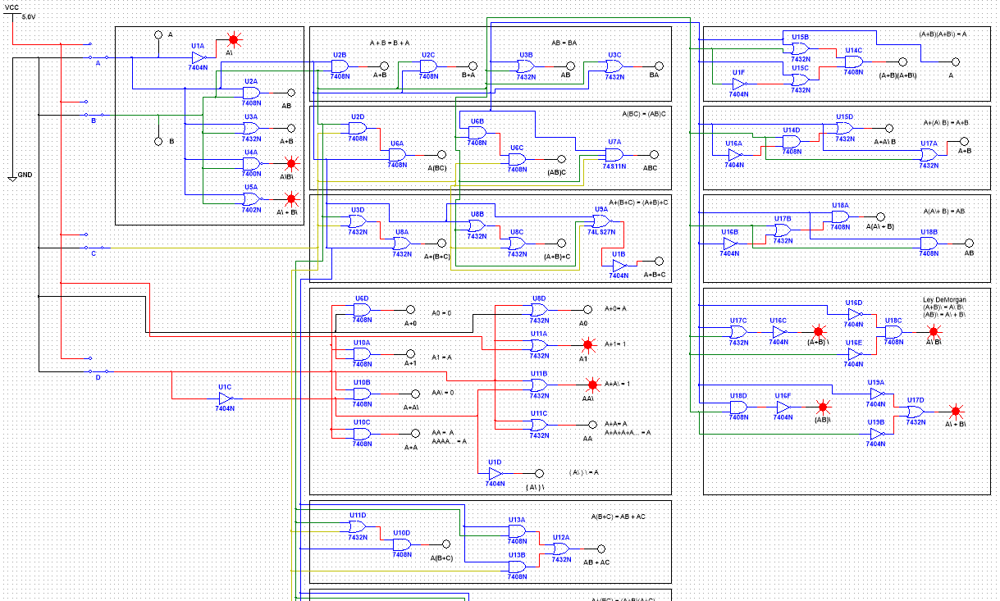
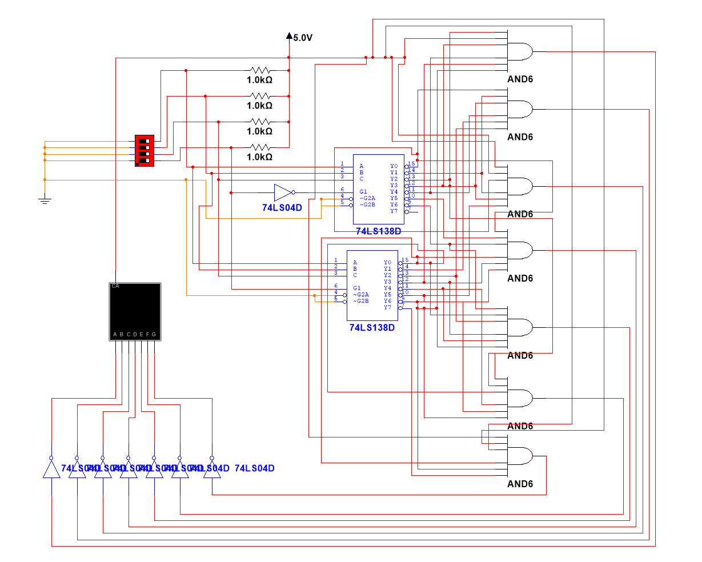

<br />
<div align="center">
	<h1 align="center">Multisim Design</h1>
	<p align="center">
    	NI Multisim project files used to study and design electronic circuits.
  	</p>
	<a href="https://github.com/abdullah-al-faahim/electronics-circuit/archive/refs/heads/main.zip" target="_blank">
        
	</a>
</div>

---

A repository of lab‑style electronic circuits modeled in **NI Multisim** for simulation-based learning.  
Includes:
- DC/AC/transient circuits  
- Diode, BJT/FET, Op‑Amp, and digital logic builds  
- Schematic files, simulation screenshots, and experiment documentation


Ideal for ECE students, instructors, and electronics enthusiasts looking to bridge theory and practical simulation.

## Installation

1. Buy or download the trial version of [NI Multisim](https://www.ni.com/en-us/support/downloads/software-products/download.multisim.html) (At least version 14.2)
3. Clone the Repo
   ```sh
   git clone https://github.com/abdullah-al-faahim/electronics-circuit.git
   cd electronics-circuit
   ```
4. Open, edit and run any of the `ms14` files provided.

</br>
<div align="center"> <p> Example of Logic Gate Equations </p> </div>


</br>
<div align="center"> <p> Example of BCD Segment Display </p> </div>


## License

Distributed under the [MIT License](https://mit-license.org/).

## Contact

Abdullah Al Fahim - alfahim604@yahoo.com
